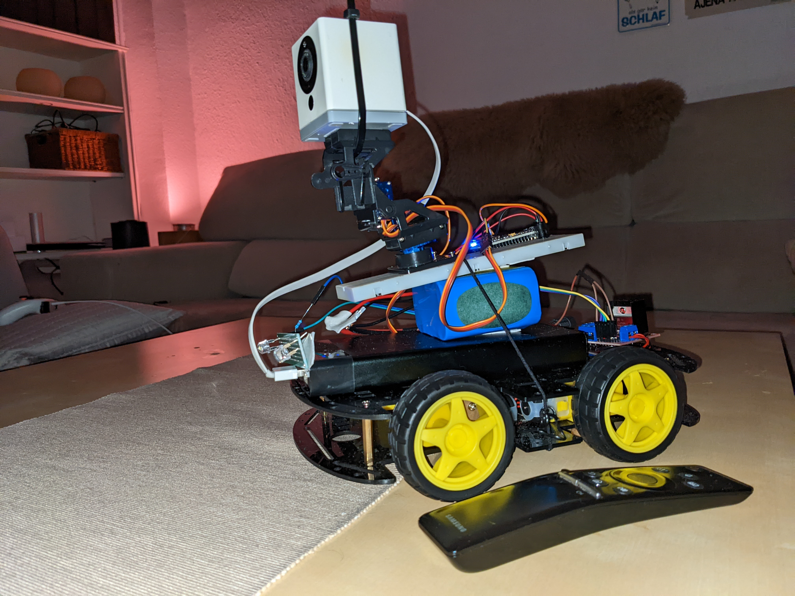
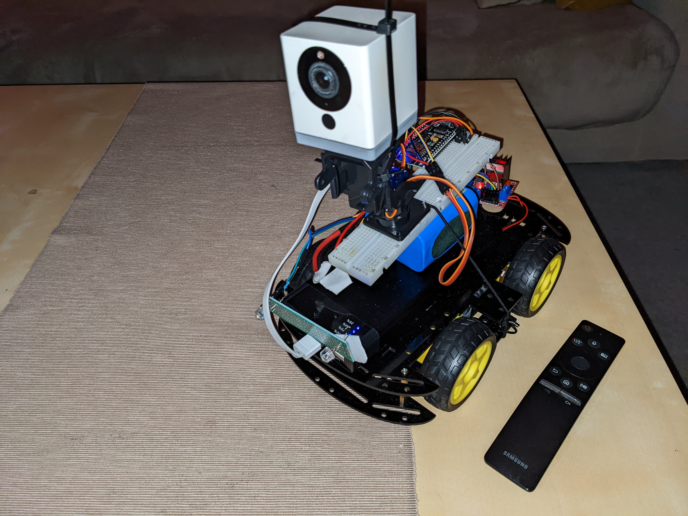

https://youtu.be/ULK-bejEP4k
 

I am not an electronics, programming or espHome expert. I have been searching and getting inspiration from videos. What I am is a big fan of Home Assistant with a multitude of home automation devices, even addicted :).

I do a RC FPV Car with espHome in a nodemcuv2 8266 board.
 
Pros:
  - Go around the house 
  - Gossip and annoy my dog

Cons:
 - Lot of lag camera and buttons
 - Very Fast Car
 - Many car crashes

(I've tried it later with an esp32cam but I can't get it to work, I'll put it aside later in the same battery).

 EVERYTHING IS QUITE PROVISIONAL, NO IMAGE DIAGRAM and has not been assembled just for testing, VERSION 0.1
  Now it's difficult to control away from home, the camera and the button presses have a lot of lag and instead the car goes very fast. Maybe is my internet connection. 

QUESTIONS:

 - Can someone tell me how to control the speed?
 - How to know the battery status?

INSPIRATION:

https://youtu.be/tyY7AN132Xs
https://youtu.be/aJeD7R48ZyI

MATERIALS:

 - Esp8266
 - 12V Battery that it works when it's charging
 -  12.6V Charger
https://a.aliexpress.com/_vECinm
- Arduino Car Kit with 4 TT motors and wheels
https://a.aliexpress.com/_ugpMKk
- 2 servo motors  SG90 360
Or
- 2 servo motors MG996 360
https://a.aliexpress.com/_vYO1g4
- Servo PT Pan/Tilt and 2 servo motors
https://a.aliexpress.com/_vaiPQg
Or
- this 
-  MG996 Pan/Tilt and 2 servo motors MG996 
https://a.aliexpress.com/_v7d13E
- Dupont Cable
 https://a.aliexpress.com/_vOOCXW
 - Portable Battery for the usb camera
 - rtsp USB Camera (Xiaomi Xiaofang in my case)

OPTIONAL: 

 - Buck Converter for regulate power
 https://a.aliexpress.com/_vMJBkM
  - Soldering PCB boards
https://a.aliexpress.com/_vnVAiM
  - Led lights
https://a.aliexpress.com/_vkivtW
  - Transistors
  - Ohms
  - Esp32cam
  - 3d printed case for battery docker station

TO DO OR WISHLIST:

- Know the correct code to Control speed in L298
- Add Esp32cam because the Lag, connected to the same battery
- Add 1 or 3 more front lights, maybe also 4 backlights using ohms and transistors
- Fix the way the sensor battery know the correct pins or correct code
- Add a battery docker station "like a robot vacuum"
- Charge the usb camera with the same battery if it can with everything 

#esphome #rccar #rccars #rc #homeassistant #L298N #ttmotors #esp8266 #esp32cam #fpv #fpvcar #fpvwifi #wificar #rcwifi #car #cars #wirelessrccar #radiocontrol #esphomerobot #robotcar #robotcar #esphomecar #esphomeproject #esphomeservo #esphomepantilt

