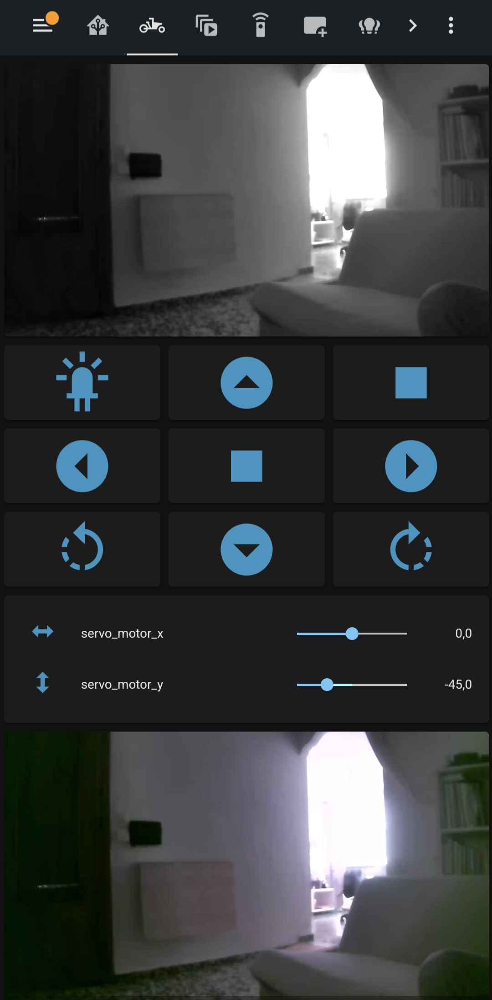

 
https://youtu.be/ULK-bejEP4k

I am not an electronics, programming or espHome expert. I have been searching, getting inspiration from videos and looking for information until I put the pieces together. What I am is a big fan of Home Assistant with a multitude of home automation devices, even addicted :).

I do a RC FPV Car with espHome in a nodemcuv2 8266 board.
 
Pros:
  - Go around the house 
  - Gossip and annoy my dog

Cons:
 - Lot of lag camera and buttons
 - Very Fast Car
 - Many car crashes

(I've tried it later with an esp32cam but I can't get it to work, I'll put it aside later in the same battery).

 EVERYTHING IS QUITE PROVISIONAL, I DON'T HAVE IMAGE DIAGRAM YET and has not been assembled yet, this video is just for testing, VERSION 0.1.
  Now it's difficult to control away from home, the camera and the button presses have a lot of lag and instead the car goes very fast. Maybe is my internet connection. 

QUESTIONS:

 - Can someone tell me how to control the speed?  I know that it is possible with Arduino but with the EspHome code I have not found it, something similar but not understand it at all.  There are 2 switches of 4 controlling several at the same time, I don't know how to do it.
 - How to know the battery status?
 - How to connect 2 or more led lights to same pin with transistors and ohms?
 - How to control led lights brightness without binary

INSPIRATION:

https://youtu.be/tyY7AN132Xs
https://youtu.be/aJeD7R48ZyI
https://github.com/ishakmuhamad/rc-car-homeassistant

MATERIALS:

 - Esp8266
 - 12V Battery, the car works when it's charging so it's possible to do a battery docker station later. 12V 6800mah 18650 6.8Ah Li-ion Rechargeable Battery With BMS Lithium Battery Packs Protection Board 
 -  12.6V Charger
https://a.aliexpress.com/_vECinm
- Arduino Car Kit with 4 TT motors and wheels
https://a.aliexpress.com/_ugpMKk
- 2 servo motors  SG90 360
Or
- 2 servo motors MG996 360
https://a.aliexpress.com/_vYO1g4
- Servo PT Pan/Tilt and 2 servo motors
https://a.aliexpress.com/_vaiPQg
Or
- this 
-  MG996 Pan/Tilt and 2 servo motors MG996 
https://a.aliexpress.com/_v7d13E
- Dupont Cable
 https://a.aliexpress.com/_vOOCXW
 - Portable Battery for the usb camera
 - rtsp USB Camera (Xiaomi Xiaofang in my case) because I want a better image quality and night vision

OPTIONAL: 

 - Buck Converter for regulate power
 https://a.aliexpress.com/_vMJBkM
  - Soldering PCB boards
https://a.aliexpress.com/_vnVAiM
  - Led lights
https://a.aliexpress.com/_vkivtW
  - Transistors
  - Ohms
  - Esp32cam
  - 3d printed case for battery docker station

DIAGRAM INSPIRATION: (Not exactly mine)

FILE CONFIGURATION:

 - I'm not going to say here how to install an esp8266 in Home Assistant, there are many tutorials on YT. 
 - Once the installation is done, copy and paste the RC-Car.yaml file, change your ssid and WiFi password validate it and upload it. 
 - Then several entities should appears at Home Assistant:
     - switch.input1
     - switch.input2
     - switch.input3
     - switch.input4
     - light.led_cam
     - service: esphome.rc_car_control_servo_x
     - service: esphome.rc_car_control_servo_y 
 - You have to create two input numbers in helpers from min -100 and max 100 with slider, must be this names:
     - input_number.servo_x
     - input_number.servo_y
 - Once created this input_numbers them copy and paste the content of automations.yaml in your automation.yaml
 - Also copy and paste the content of scripts.yaml into your scripts.yaml file
 - In your Home Assistant Lovelace or Dashboard:
     - Create a Camera Live Card 
     - Create a Grid card with all buttons (example if you want to paste in code)
     - Create a Camera auto Card
 - Thats It! Have a good time!

TO DO OR WISHLIST:

- Know the correct code to Control speed in L298N
- Add or use only a Esp32cam because the Lag, connected to the same battery or just the esp32 cam like a unique board but without other optionals led lights
- Add 1 or 3 more front lights, maybe also 4 backlights using ohms and transistors
- Fix the way the sensor battery know the correct pins or correct code
- Add a 3d printed battery docker station "like a robot vacuum"
- Charge the usb camera with the same battery if it can with everything 

#esphome #rccar #rccars #rc #homeassistant #L298N #ttmotors #esp8266 #esp32cam #fpv #fpvcar #fpvwifi #wificar #rcwifi #car #cars #wirelessrccar #radiocontrol #esphomerobot #robotcar #robotcar #esphomecar #esphomeproject #esphomeservo #esphomepantilt

